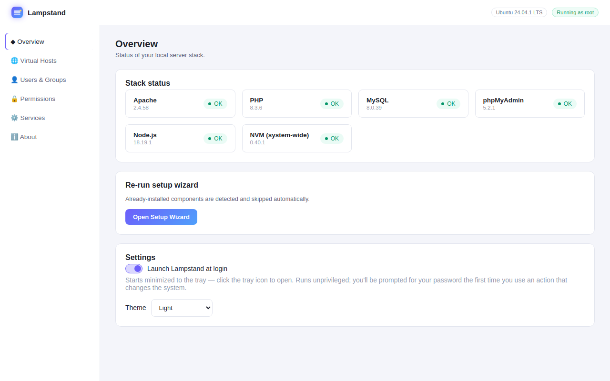
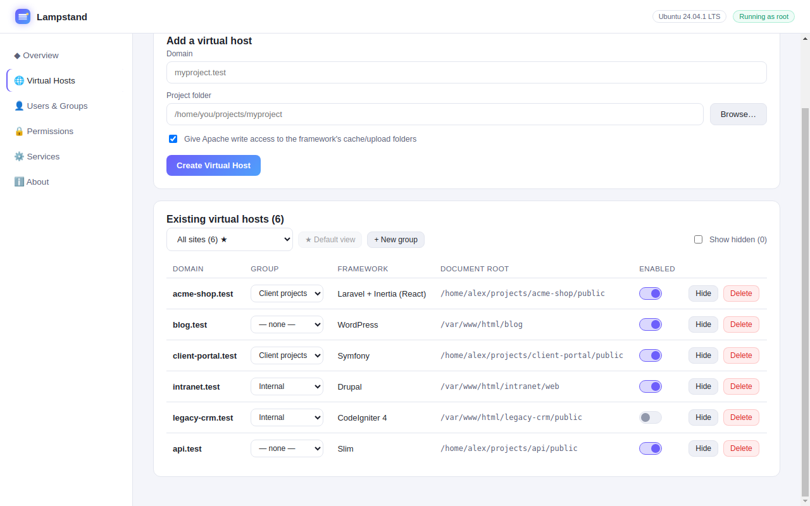
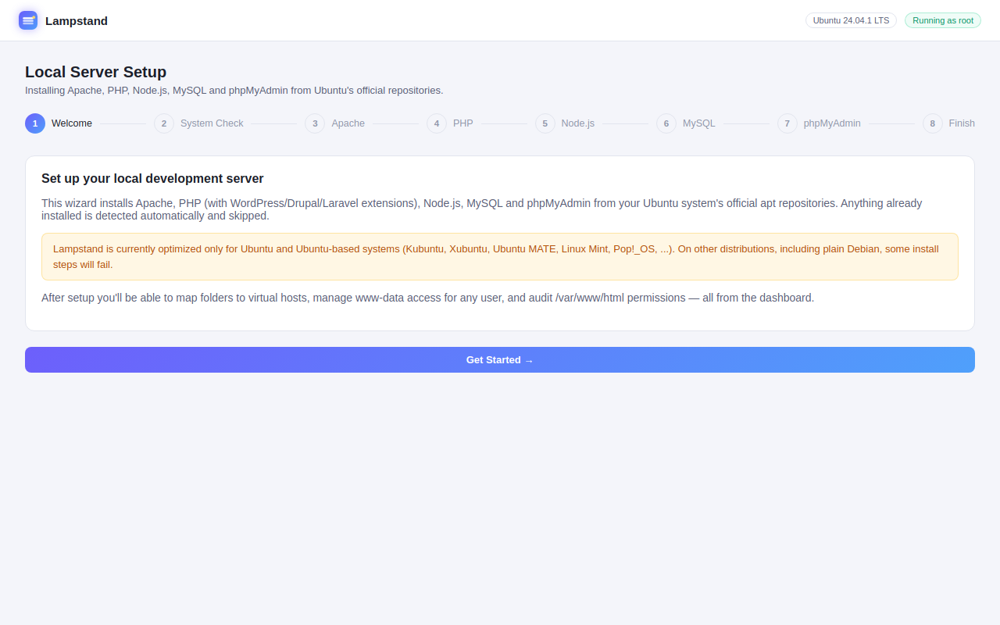
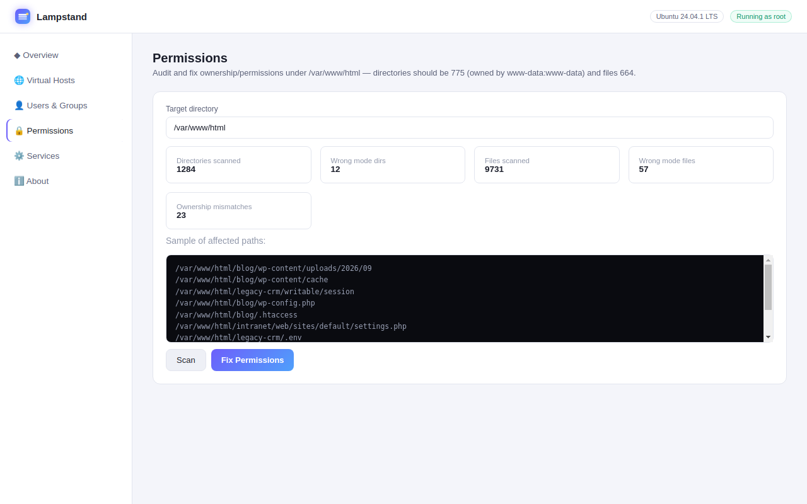
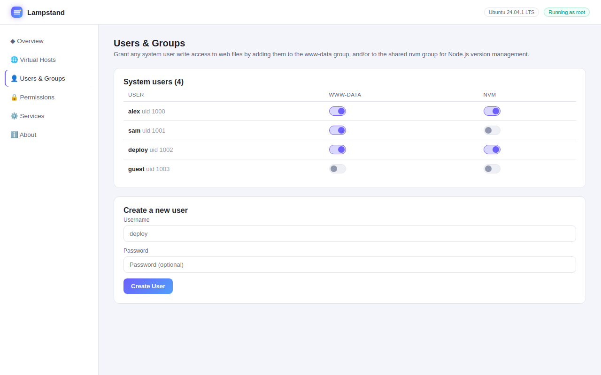
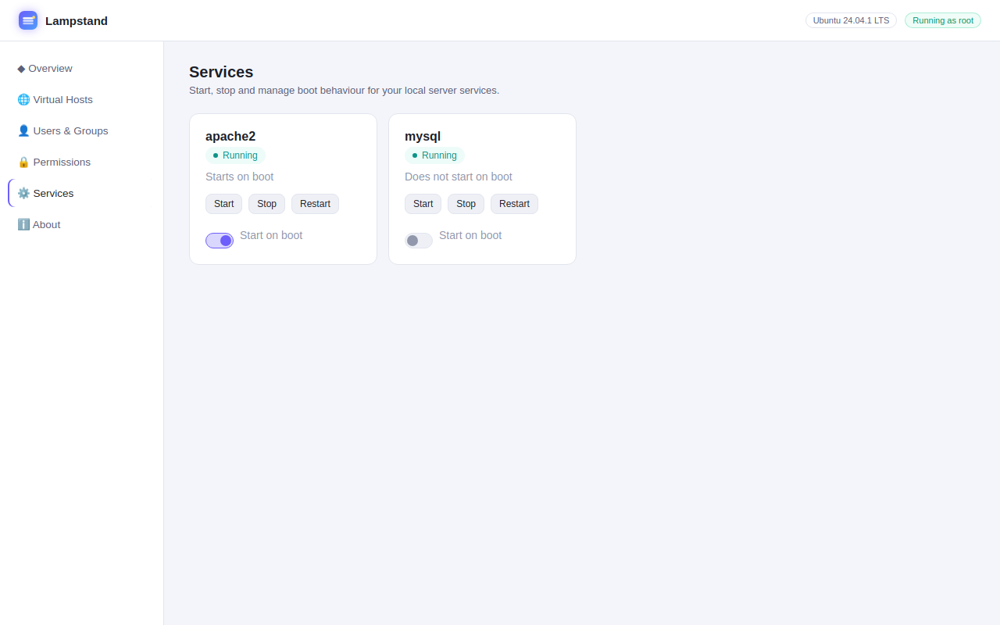

<p align="center"></p>

# Lampstand: LAMP stack installer and Apache virtual host manager for Ubuntu

<p align="center">
  <a href="https://github.com/tejashingu/Lampstand/releases/latest"></a>
  <a href="LICENSE"></a>
  
</p>

Lampstand is a free, open-source desktop app (GUI) that sets up a **local LAMP development
environment on Ubuntu** — Apache, PHP, MySQL, phpMyAdmin and Node.js — in a few clicks, then
lets you manage **Apache virtual hosts**, `/etc/hosts` entries, `www-data` permissions and
services without touching the terminal. It can also install **WordPress, Laravel, Symfony,
Drupal** and other PHP frameworks into a new local site. Think of it as a XAMPP/MAMP-style
tool built natively for Ubuntu's own packages.

**[Download the latest .deb or AppImage →](https://github.com/tejashingu/Lampstand/releases/latest)**

> **Ubuntu only (for now).** Lampstand is built and tested for Ubuntu and Ubuntu-based systems:
> the official flavours (Kubuntu, Xubuntu, Lubuntu, Ubuntu MATE, ...) and derivatives that use
> the Ubuntu archive (Linux Mint, Pop!_OS, Zorin OS, ...). It relies on `apt`, Ubuntu's
> `mysql-server` package and Ubuntu's MySQL/phpMyAdmin defaults, so on other distributions,
> including plain Debian (which ships MariaDB), some or all install steps will fail.

## Screenshots

Screenshots show sample data.

| Overview | Virtual hosts |
| --- | --- |
|  |  |
| **Setup wizard** | **Permissions** |
|  |  |
| **Users & groups** | **Services** |
|  |  |

To regenerate them from the current UI: `npx electron scripts/screenshots/main.js`.

## What it does

**Setup wizard** (auto-detects what's already installed and skips it):
- Apache2
- PHP + the extension set needed by WordPress, Drupal and Laravel (`mbstring`, `curl`, `gd`,
  `xml`, `zip`, `intl`, `bcmath`, `mysqli`/`PDO`, `opcache`, `imagick`, `soap`, ...)
- Node.js (via apt) and **NVM installed system-wide** (`/usr/local/nvm`, loaded for every user
  via `/etc/profile.d/nvm.sh`, shared `nvm` group for write access)
- MySQL Server, with the standard `mysql_secure_installation` hardening applied automatically
- phpMyAdmin, wired into Apache with zero interactive prompts

All packages come from Ubuntu's official apt repositories — nothing is downloaded from
third-party PPAs.

**Dashboard**, once set up:
- **Virtual Hosts** — pick a project folder, give it a local domain, and it creates the Apache
  vhost config, adds the `/etc/hosts` entry, and reloads Apache. Enable/disable or delete from
  the same screen — deleting can optionally remove the project files and database as well.
  - **Framework installs** — optionally install a fresh project into an empty folder: WordPress
    (with its MySQL database, user and `wp-config.php` created for you), Laravel, Laravel +
    Inertia (React or Vue) and Laravel + Livewire starter kits (assets built with npm), Symfony,
    Drupal, CodeIgniter 4, CakePHP, Yii 2 or Slim. Composer/npm run as the folder's owner, not
    root, and Composer is installed from apt if it's missing.
  - **Existing-folder scan** — point it at a folder that already has a project and it detects
    WordPress (incl. Bedrock), Laravel (and which Inertia/Livewire stack), Drupal, Symfony,
    CodeIgniter, CakePHP, Yii, Craft CMS, Slim or Joomla, sets the right document root
    (`public/`, `web/`, `webroot/`, ...), and can give Apache write access to the cache/upload
    folders. You can override the detected framework if the scan gets it wrong.
  - `mod_rewrite` is enabled automatically, and you're warned if Apache can't reach the folder
    (e.g. a private home directory).
- **Users & Groups** — toggle any system user's membership in `www-data` (so they can write to
  the web root) and the shared `nvm` group, or create a brand-new user.
- **Permissions** — scans `/var/www/html` for anything that isn't `www-data:www-data`,
  directories at `775`, and files at `664`, then fixes it all in one click (with the setgid bit
  set on directories so new files inherit the group).
- **Services** — start/stop/restart Apache and MySQL, and toggle whether they start on boot.
- **Settings** — a "Launch Lampstand at login" toggle (Overview tab) adds/removes a standard
  XDG autostart entry in your own `~/.config/autostart/`, correctly attributed to you even
  though the app itself runs as root. The autostart launch is unprivileged and starts minimized
  to a system tray icon (open it from there, or Quit) — no password prompt interrupts your login,
  and you still get the usual prompt the first time you use a privileged action in that session.
  The same card has a **Theme** picker (Match System / Light / Dark) — "Match System" follows
  the OS light/dark setting automatically via `prefers-color-scheme`; the explicit choices
  override it and persist locally.
- **About** — app version, author, contact and project links, and the privacy note below.

## Running from source

Everything that touches the system (apt, systemctl, chown, usermod, Apache/hosts config) needs
root, so the whole app runs as root — there's no per-action password prompting.

```bash
npm install        # as your normal user
sudo ./scripts/start.sh
```

The script re-execs itself with `sudo` if needed and launches Electron with `--no-sandbox`
(required by Chromium when running as root).

## Distribution

### 1. Build installable packages

```bash
npm run dist
```

`electron-builder` (already configured in `package.json`) produces two artifacts in `dist/`:

- **`Lampstand-1.2.2.AppImage`** — a single portable executable, no installation needed.
  `chmod +x` it and double-click, or run it from a terminal.
- **`lampstand_1.2.2_amd64.deb`** — a normal Debian package for `sudo apt install ./lampstand_*.deb`
  or `sudo dpkg -i` (installs to `/opt/Lampstand`).

The app menu icon these create launches Lampstand **unprivileged** — you get the dashboard
(status, browsing vhosts/users/permissions) straight away, with a "Not root" banner. Any action
that changes the system (installs, `chown`/`chmod`, `usermod`, editing Apache config, ...) will
error asking you to relaunch with elevated privileges. Two ways to get those:

- Run it from a terminal with `sudo lampstand` (or `pkexec lampstand`).
- Or install the bundled **admin launcher**: copy
  `build/lampstand-admin.desktop.template` to `~/.local/share/applications/lampstand-admin.desktop`
  (drop the `.template` suffix). It adds a second "Lampstand (Admin)" icon to your app menu that
  launches via `pkexec`, showing a native polkit password prompt — no terminal needed. It assumes
  the `.deb` install path (`/opt/Lampstand/lampstand`); adjust the `Exec=` line if you're running
  the AppImage instead.

### 2. Publish a release

Releases are built and published automatically by GitHub Actions
([`.github/workflows/release.yml`](.github/workflows/release.yml)). To cut a new version:

1. Bump `"version"` in `package.json` (e.g. `1.3.0`) and commit it.
2. Tag the commit with the same version and push the tag:
   ```bash
   git tag v1.3.0
   git push origin v1.3.0
   ```
3. The workflow checks that the tag matches `package.json`, builds the `.AppImage` and `.deb`,
   and creates a GitHub Release named "Lampstand 1.3.0" with both files attached and
   auto-generated release notes.

Users download from the
[Releases page](https://github.com/tejashingu/Lampstand/releases/latest), or from a terminal:

```bash
wget https://github.com/tejashingu/Lampstand/releases/download/v1.2.2/lampstand_1.2.2_amd64.deb
sudo apt install ./lampstand_1.2.2_amd64.deb
```

### 3. Further options (not set up yet, worth knowing about)

- **PPA / apt repository** — lets users `add-apt-repository` and get updates via `apt upgrade`.
  Needs a Launchpad account and GPG-signed uploads; more setup than most personal tools need.
- **Snap Store** — very Ubuntu-native, but Lampstand needs broad root access (apt, systemctl,
  usermod, arbitrary file ownership) that doesn't fit cleanly into Snap's confinement model
  without `classic` confinement, which requires manual Snap Store approval.
- **Self-hosted download page** — if you don't want a public GitHub repo, you can host the
  `.deb`/`.AppImage` files anywhere (your own site, a private release, etc.) — the install steps
  for the end user stay the same.

For most cases, GitHub Releases (#2 above) is the right amount of effort: no server to run, free
hosting, and versioned downloads users can trust.

## Privacy

Lampstand does not collect any telemetry, analytics or usage data, and has no crash reporting
or auto-update check. It only goes online for actions you start yourself, and only to official
sources:

| What | Where it comes from |
| --- | --- |
| Apache, PHP, MySQL, phpMyAdmin, Node.js, Composer | Ubuntu's official apt repositories |
| WordPress | `https://wordpress.org/latest.tar.gz` |
| Laravel (+ starter kits), Symfony, Drupal, CodeIgniter, CakePHP, Yii, Slim | Each project's official package on Packagist, via `composer create-project` |
| Frontend dependencies for the Laravel starter kits | The npm registry, via `npm install` |
| NVM | The official `nvm-sh/nvm` GitHub repository (pinned release) |

## Safety notes

- On first launch you'll be asked to accept a short terms notice: this software modifies system
  packages and files, is provided with no warranty, and is released under the MIT license (see
  [LICENSE](LICENSE)).
- Deleting a virtual host opens a dialog showing the site's framework, project folder and
  database (read from `wp-config.php`, `.env`, Drupal's `settings.php`, ...). By default only the
  Apache config and `/etc/hosts` entry are removed. You can also tick **Delete all project
  files** and/or **Drop the MySQL database** (its MySQL user is dropped too, unless it has
  access to other databases); either one requires typing the domain to confirm. Lampstand
  refuses to delete system folders, home folders, `/var/www/html`, or any folder another site
  still uses, and won't drop system or remote databases.
- The Permissions tool only ever targets the directory you point it at (default
  `/var/www/html`); it validates the path before running `chown`/`chmod`.

## Reporting bugs

Found a bug or something not working on your system? Please open an issue at
[github.com/tejashingu/Lampstand/issues](https://github.com/tejashingu/Lampstand/issues), including
your Ubuntu version (`lsb_release -a`), the Lampstand version (shown on the About tab), what you
did, and any error shown in the app's log output.

## Project layout

```
main.js                     Electron main process, IPC handlers, root check
preload.js                  contextBridge API surface exposed to the renderer
backend/                    System automation: apt, apache, mysql, phpmyadmin, users, permissions, services
renderer/                   UI (vanilla HTML/CSS/JS, no build step)
scripts/start.sh            Dev launcher (sudo + --no-sandbox)
docs/screenshots/           Screenshots used by this README and the AppStream metainfo
scripts/screenshots/        Regenerates the screenshots from the real UI with sample data
.github/workflows/          Release workflow (builds and publishes on v* tags)
build/icon.png                        App icon used by electron-builder
build/lampstand-admin.desktop.template  Optional pkexec-based admin launcher (see Distribution)
```

## License

MIT — see [LICENSE](LICENSE).

---

Built by [Tejas Hingu](mailto:tejas@tejashingu.com).
